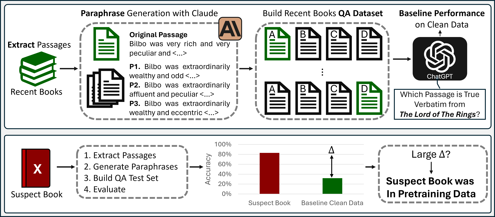

# DE-COP 👮
This is the official repository for the paper [DE-COP: Detecting Copyrighted Content in Language Models Training Data](https://www.google.com) by *André V. Duarte, Xuandong Zhao, Arlindo L. Oliveira and Lei Li* <br>

[Paper](https://arxiv.org/abs/2402.09910) || [BookTection Benchmark](https://huggingface.co/datasets/avduarte333/BookTection) || [arXivTection Benchmark](https://huggingface.co/datasets/avduarte333/arXivTection) 


DE-COP is a method for Detecting Copyrighted Content in the Language Models Training Data. It employs probing tasks structured as multiple-choice questions, whose options include both verbatim text and their paraphrases.



---
## DE-COP Example
⚠ Important: Ensure to add the API key in 2_decop_blackbox.py and HF LLaMA-2 access token in 2_decop_hf.py<br>

---
First, obtain Multiple-Choice-Question-Answering results with DE-COP.<br>
- Model is ChatGPT or Claude
```
python 2_decop_blackbox.py --data <data_file> --target_model <model_name> [--length <passage_size>]

#Run Example 1 - BookTection
python 2_decop_blackbox.py --data BookTection --target_model ChatGPT --length medium

#Run Example 2 - arXivTection
python 2_decop_blackbox.py --data arXivTection --target_model Claude
```

- Model is from LLaMA-2 family (7B, 13B, 70B)
```
python 2_decop_hf.py --data <data_file> --target_model <model_name> [--length <passage_size>]

#Run Example:
python 2_decop_hf.py --data BookTection --target_model LLaMA-2-70B --length medium
```

Secondly, obtain DE-COP AUC Values.<br>
```
python 3_get_results_blackbox.py --data <data_file> [--length <passage_size>]

#Run Example 1 - BookTection
python 3_get_results_blackbox.py --data BookTection --length medium

#Run Example 2 - arXivTection
python 3_get_results_blackbox.py --data arXivTection
```


### 📚 [arXivTection](https://huggingface.co/datasets/avduarte333/arXivTection) and [BookTection](https://huggingface.co/datasets/avduarte333/BookTection) Datasets
The arXivTection and the BookTection datasets serve as benchmarks designed for the task of detecting pretraining data from Large Language models.

The arXivTection consists of 50 research papers extracted from arXiv. 
- 25 published in 2023: Non-Training data, "_label_" column = 0.
- 25 published before 2022: Training data, "_label_" column = 1.

The BookTection consists of 165 books. 
- 60 published in 2023: Non-Training data, "_label_" column = 0.
- 105 published before 2022: Training data, "_label_" column = 1.


From each paper / book ≈ 30 passages are extracted. Each passage is paraphrased 3 times using the Language Model Claude v2.0. <br>
The "_Answer_" column indicates which of the passages is the real excerpt.<br>
Passages on arXivTection are extracted to be on average ≈ 128 tokens in length.<br>
Passages on BookTection come in 3 different sizes (small, medium and large) which aim to be respectively ≈(64, 128 and 256) tokens in length.

<br>
<br>

### 🧪 Testing Models on the Benchmarks
Our datasets are planned to be used on a Multiple-Choice-Question-Answering format. Nonetheless, other pretraining data detection methods can be used.<br>

<br>
<br>

### 🤝 Compatibility
The Multiple-Choice-Question-Answering task with our Dataset is designed to be applied to various models, such as:<br>
- LLaMA-2
- Mistral
- Mixtral
- ChatGPT (gpt-3.5-turbo-instruct)
- GPT-3 (text-davinci-003)
- Claude


## Citation

If you find this work useful, please consider citing our paper:

```bibtex
@misc{duarte2024decop,
      title={{DE-COP: Detecting Copyrighted Content in Language Models Training Data}}, 
      author={André V. Duarte and Xuandong Zhao and Arlindo L. Oliveira and Lei Li},
      year={2024},
      eprint={2402.09910},
      archivePrefix={arXiv},
      primaryClass={cs.CL}
}
```
